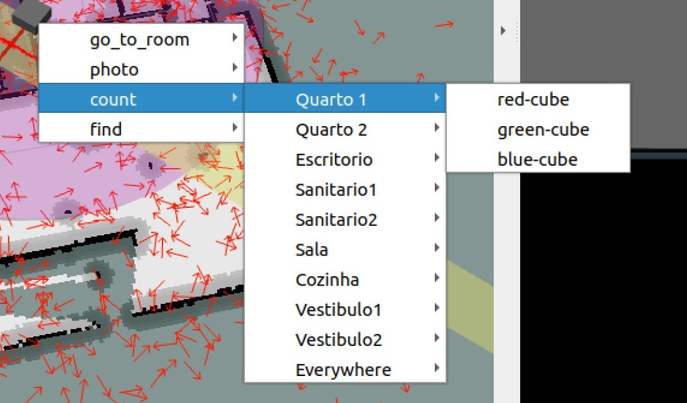
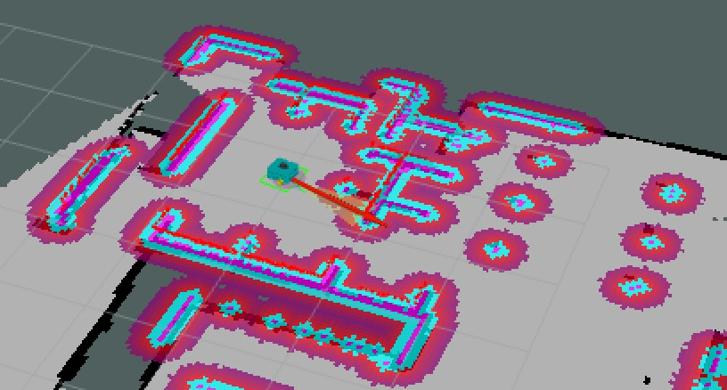
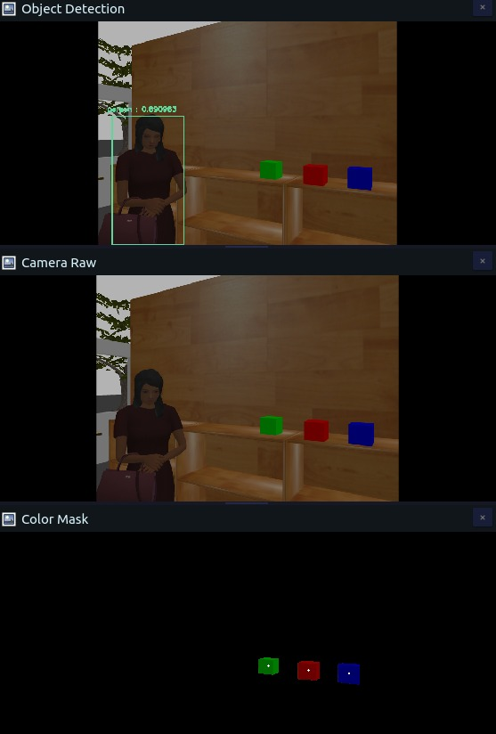

# Robutler-G1

<!-- Create table -->
| Nome                      | e-mail          | Nºmec |
| ------------------------ | -------------- | -------- |
| Henrique Sousa | henrique@ua.pt | 98324|
| José Santos | josesantos01@ua.pt |98279|
|Roberto Figueiredo |robertof@ua.pt| 116147|

---

# Sumary 

* [Overview](#overview)
* [Setting up](#setup)
* [How to use](#how-to-use)


## Overview

Practical work 3 carried out within the scope of the PSR curricular unit. It uses ROS to implement a robot able to autonomously move and perform tasks, such as identify objects, count objects, take photos, etc.


## Setup

Include here what it is necessary to work

Install this dependencies:
``` bash
sudo apt-get install ros-noetic-joy 
sudo apt-get install ros-noetic-robot-state-publisher
sudo apt-get install ros-noetic-move-base  
sudo apt-get install ros-noetic-map-server
sudo apt-get install install ros-noetic-move-base 
sudo apt-get install python3-opencv
``` 
Install python packages using pip:
``` bash
pip install -r requirements.txt
```
Export environment variable:

``` bash
export TURTLEBOT3_MODEL=waffle_pi
```

## How to use

- ### Launching
  - 
- ### Requesting a mission
  - Using RVIZ around the robot there is a grey cube, if right clicked a menu shows-up
  
  - This menu is automatically populated by the contents of properties.yaml, how the menu is populated can be restricted based on the type of mission


For ease of use, we created launch files to launch of the packages, mostly for the manual testing of the programs. 
Here is a lisf of the launch files used, their packages and their functions:

- robutler_bringup
  - `navigation.launch` - Launches the navigation stack to move automatically the robot.
  - `gazebo.launch` - Launches the gazebo simulation,rviz, the navigation and the robot.
  - `spawn.launch` - Spawns only the robot.
  - `navigation.launch` - Use of acml package for localization, also use of map file and /scan topic to relocate the robot.
  

- robutler_vision
  - `vision.launch` - uses `object_detection.py` and `color_detection.py` to detect objects and colors.
  
- robutler_missions
  - `mission.launch` - Launches the `mission.py`, that creates the interactive menu.
  
- robutler_navigation
  - `localization.launch` - locates the robot in the map.


## Changes/ Implementations
<details> 
  <summary>Implementations made and missions achieved ...</summary>


### Missions 
The missions possible that can be done by the robot are the following:
1. Go to a specific location  in acordance to user input
2. Go to a predefined location based on which room the user wants to go to
3. Find objects of a specific color
4. Categotize objects based on their caracteristics
5. Try and find objects in the map
 


### Interactive Rviz menu
The rviz menu was implemented in order to make the actions of the robot easier to do, by implementing a interactive menu. This menu has several options, these include:
- Going to a specific room. 
- Taking a picture.
- Finding a specific object in the map.
- Looking for a specific object only in a certain room.


### Navigation
For the robot to navigate the map, it uses the map and uses the same method for all the movements and finds the shortest distance to that position.
In the video below we can see the robot navigating the map. 


To make it so that the robot doesnt crash, its taken into consideration the obstacles and the safe distace from them, being created a cost map that creates a safety zone around the obstacles, where the robot either slows down or stops, depending on the distance from the obstacle.
In the image below its possible to see the cost map.



### Mapping
The mapping of the apartment was recorded using SLAM to a `.pmg` file, whitch is afterwards launched in the `navigation.launch` on the robutler_bringup package. This launch file also contains the particle filter, whitch is only used when the robot doesnt know its position, after being moved or after a reset.

[exemplo de imagem do rviz com o mapa e filtro de particulas a funcionar]

### Object Spawning
Due to one of the missions being the usage of finding certaint objecs on the apartment. The usage of a object spawner was implemented, so that the robot could spawn objects in the map, in order to test the object detection program and its navigations skills.


### Teleoperation
Due to our use of the teleoperation was use only initially and while testing and while debugging, the `rqt_robot_steering` plugin was originally used, however the `keyboard_teleop.launch` is a more simple and usable version, used from the turtlebot_teleop package.

[image maybe?]

### Vision
To simplify the operation of vision, the process was devided into two programs. Both work with the same image, that was taken by the camera when the robot is in the [Some type of state].

The `object_detection.py` program, uses the yolov3 model to detect objects, and then uses this information and displays the objects it detects, with a bounding box around it. These bounding boxes only appear on certaint obexts, using the names of the objects the model can detect and the weight of each object, using the `coco.names` and `yolov3-tiny.weights` files respectively.


The `color_detection.py` program, obtains the contours and the centroids of each color that we implemented, these being red, blue and green. Whith this information, the program subtracts the information given, showing only the detected objects with those colors.


On the image below we can see the results of the `object_detection.py` program, where we can see the bounding boxes around the objects detected, and the `color_detection.py` program, where we can see the centroids of the objects detected and the mask created using the contours of the objects.




### Robot changes

Due to certain limitations of the robot, certain features couldn't be made, the most crucial one being spotting objects that weren't on the ground level. To fix that, we implemented a second camera by modeling a new object onto the robot, where the new camera would be located.

To do this, we changed the `robutler.urdf.xacro` file so we could model the new part of the robot, this being a antenna, with a  size of 1.5 meters. 

We tried the possibility of creating a prismatic joint, where it would be retracted while moving and only extended when either the program or the user wished to search for a object. However, after doing several tests, it wasn't possible to create this prismatic joint and still be able to obtain the cameras' joints information and therefore the camera. 
Another possibility is the use of two cameras, to try and detect when a certain object is above or below a specific object, such has a table.  However, this wasn't possible to implement due to the limitations of our code, because we focused on implementing all of the features with a single camera.


</details>


