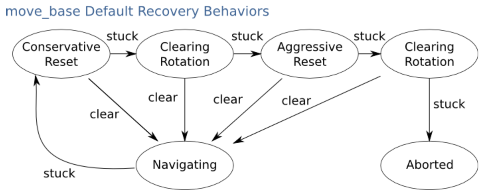
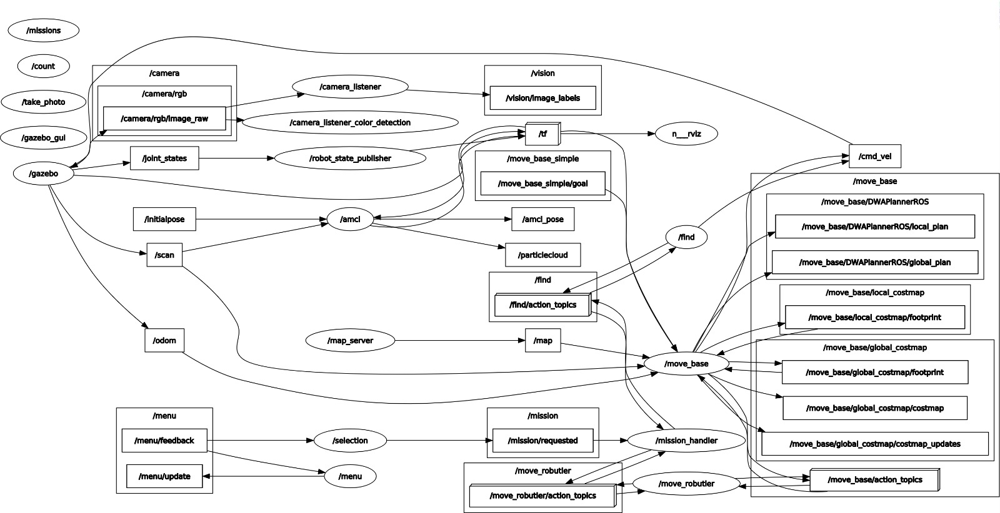

<h1> Robutler-G1 </h1>

| Nome                      | e-mail          | Nºmec |
| ------------------------ | -------------- | -------- |
| Henrique Sousa | hsousa@ua.pt | 98324|
| José Santos | josesantos01@ua.pt |98279|
|Roberto Figueiredo |robertof@ua.pt| 116147|

---
<H1> Summary </h1>

- [Overview](#overview)
- [Setup](#setup)
- [How to use](#how-to-use)
  - [Launching](#launching)
  - [Requesting a mission](#requesting-a-mission)
- [Vision](#vision)
- [Mapping Localization and planning](#mapping-localization-and-planning)
- [Robot changes](#robot-changes)
- [rqt\_graph](#rqt_graph)
---
## Overview

Practical work 3 carried out within the scope of the PSR curricular unit. It uses ROS to implement a robot able to autonomously move and perform tasks, such as identify objects, count objects, take photos, etc.


## Setup

Include here what it is necessary to work

Install this dependencies:
``` bash
$ sudo apt-get install ros-noetic-joy 
$ sudo apt-get install ros-noetic-robot-state-publisher
$ sudo apt-get install ros-noetic-move-base  
$ sudo apt-get install ros-noetic-map-server
$ sudo apt-get install install ros-noetic-move-base 
$ sudo apt-get install python3-opencv
``` 
Install python packages using pip:
``` bash
$ pip install -r requirements.txt
```
Export environment variable:

``` bash
export TURTLEBOT3_MODEL=waffle_pi
```

## How to use

### Launching 

```
$ roslaunch robutler_bringup gazebo.launch
```
```
$ roslaunch robutler_bringup bringup.launch  
```
```
$ roslaunch robutler_navigation localization.launch
```

```
$ roslaunch robutler_missions missions.launch 
```

```
$ roslaunch robutler_controller action_server.launch 
```

```
$ roslaunch robutler_vision vision.launch
```
<details> 
  <summary>Opcionais</summary>

```
$ ./launch_scripts/spawn_objects.sh 
```
(Automaticaly spawns objects)

```
$./launch_scripts/move_robutler.sh
```
(Control the robot using the keyboard WASD)

```
$ ./move_robutler_to.sh <X> <Y>
```
(Send an action to move the robot to `X` and `Y` coordinates)
</details>

### Requesting a mission
The rviz menu was implemented in order to make the actions of the robot easier to do, by implementing a interactive menu.
  - Using RVIZ around the robot there is a grey cube, if right clicked a menu shows-up
  
  - This menu is automatically populated by the contents of properties.yaml, how the menu is populated can be restricted based on the type of mission

  This includes:
  - **go_to_room**: sends the robot to a desired room
  -  **photo**: takes a photo of a desired room
  -  **count**: counts the number of colored elements selected on a specific room or the entire house
  -  **find**: finds the object selected in a specific room or the entire house


## Vision
The vision system uses YOLO3-Tiny as demonstrated it has a better cost to performance ratio and is more suitable on minimal hardware 
[[1]](https://arxiv.org/pdf/1807.05597.pdf)

Vision was split into object detection using YOLO and color masking for the colored cubes.


The `object_detection.py` program, uses the yolov3 model to detect objects, and then uses this information and displays the objects it detects, with a bounding box around it. These bounding boxes only appear on certaint objects, using the names of the objects the model can detect and the weight of each object, using the `coco.names` and `yolov3-tiny.weights` files respectively.

## Mapping Localization and planning
amcl takes in a laser-based map, laser scans, and transform messages, and outputs pose estimates.
amcl is a probabilistic localization system for a robot moving in 2D. It implements the adaptive (or KLD-sampling) Monte Carlo localization approach (as described by Dieter Fox), which uses a particle filter to track the pose of a robot against a known map.[[2]](http://wiki.ros.org/amcl)


For path planning and navigation, the ROS navigation stack is used with the implemented action server `move_base`. [[3]](http://wiki.ros.org/move_base)


To make it so that the robot doesnt crash, its taken into consideration the obstacles and the safe distace from them, being created a cost map that creates a safety zone around the obstacles, where the robot either slows down or stops, depending on the distance from the obstacle. In the image below its possible to see the cost map.

<!-- two image table -->
Navigation Stack           |  Navigation Behaviour
:-------------------------:|:-------------------------:
  |  


For ease of use, we created launch files to launch of the packages, mostly for the manual testing of the programs. 
Here is a lisf of the launch files used, their packages and their functions:


## Robot changes
To do this, we changed the `robutler.urdf.xacro` file so we could model the new part of the robot, this being a antenna, with a  size of 1.5 meters. 

<details>
<summary>
More
</summary>
Due to certain limitations of the robot, certain features couldn't be made, the most crucial one being spotting objects that weren't on the ground level. To fix that, we implemented a second camera by modeling a new object onto the robot, where the new camera would be located.

We tried the possibility of creating a prismatic joint, where it would be retracted while moving and only extended when either the program or the user wished to search for a object. However, after doing several tests, it wasn't possible to create this prismatic joint and still be able to obtain the cameras' joints information and therefore the camera. 
Another possibility is the use of two cameras, to try and detect when a certain object is above or below a specific object, such has a table.  However, this wasn't possible to implement due to the limitations of our code, because we focused on implementing all of the features with a single camera.
</details>


## rqt_graph
Interaction between the nodes, topics and servers 




</details>


